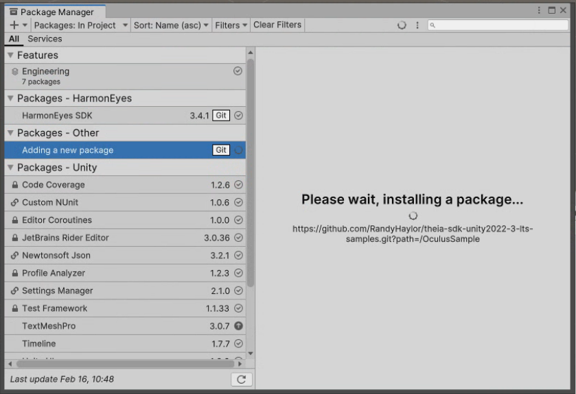

# Theia SDK - Core Package

Eye tracking SDK for Unity VR development.

## Installation via Unity Package Manager

1. Open Unity Package Manager (Window > Package Manager)
2. Click the "+" button and select "Add package from git URL..."
3. Paste this URL:

```
https://github.com/RandyHaylor/theia-sdk-core.git
```

## What's Included

- HarmonEyesSDK.dll (precompiled runtime)
- Eye tracking common scripts (AnalyzeEyeTrackingData, EyeTrackingConfig)
- HarmonEyes.EyeTracking assembly with namespace support
- Third-party dependencies (ONNX Runtime, Android libs)

## Requirements

- Unity 2022.3 or later
- Meta XR SDK (for Oculus/Meta Quest support)

## Version

Current version: 3.4.1

---

## Platform Samples

After installing the core SDK, add platform-specific samples:

### Unity 2022.3 LTS Samples

**Oculus/Meta Quest:**
```
https://github.com/RandyHaylor/theia-sdk-unity2022-3-lts-samples.git?path=/OculusSample
```

**HTC VIVE:**
```
https://github.com/RandyHaylor/theia-sdk-unity2022-3-lts-samples.git?path=/HTCViveSample
```

**Varjo (Experimental):**
```
https://github.com/RandyHaylor/theia-sdk-unity2022-3-lts-samples.git?path=/VarjoSample
```

---

### Unity 6 LTS Samples

**Oculus/Meta Quest:**
```
https://github.com/RandyHaylor/theia-sdk-unity6-lts-samples.git?path=/OculusSample
```

**HTC VIVE:**
```
https://github.com/RandyHaylor/theia-sdk-unity6-lts-samples.git?path=/HTCViveSample
```

**Varjo (Experimental):**
```
https://github.com/RandyHaylor/theia-sdk-unity6-lts-samples.git?path=/VarjoSample
```

---

### Unity 6.3 LTS Samples

**Oculus/Meta Quest:**
```
https://github.com/RandyHaylor/theia-sdk-unity6-3-lts-samples.git?path=/OculusSample
```

**HTC VIVE:**
```
https://github.com/RandyHaylor/theia-sdk-unity6-3-lts-samples.git?path=/HTCViveSample
```

**Varjo (Experimental):**
```
https://github.com/RandyHaylor/theia-sdk-unity6-3-lts-samples.git?path=/VarjoSample
```

---

## Support

For issues or questions, please open an issue on GitHub.
